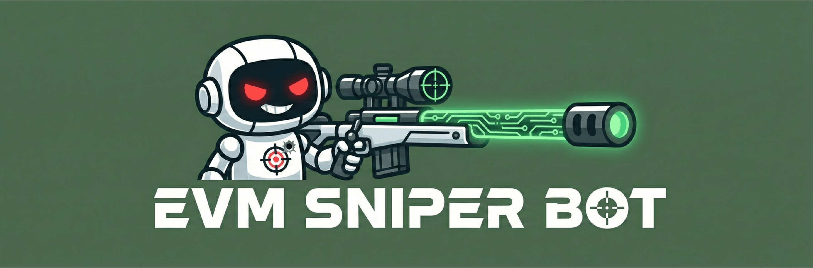
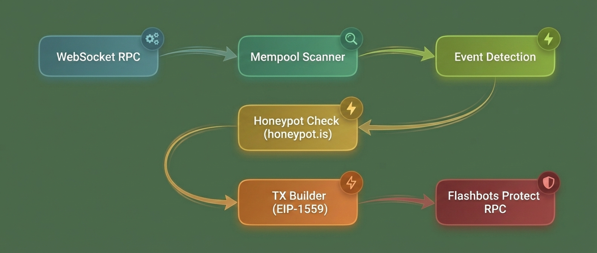
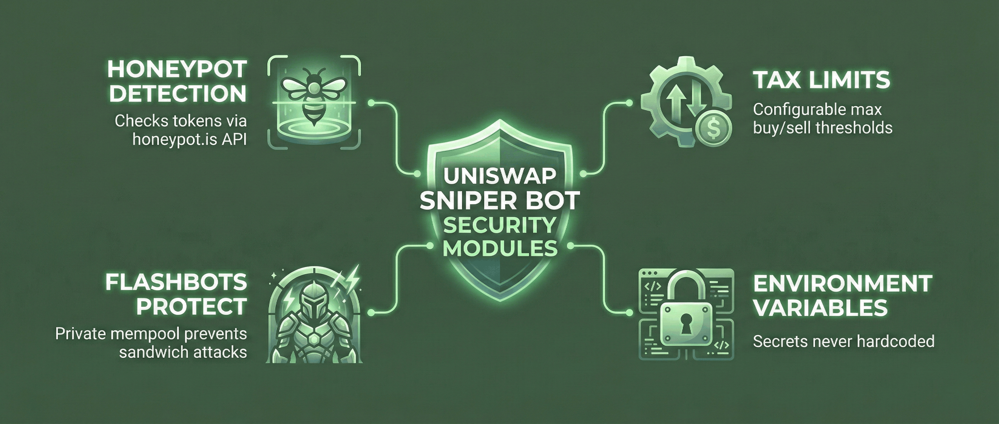
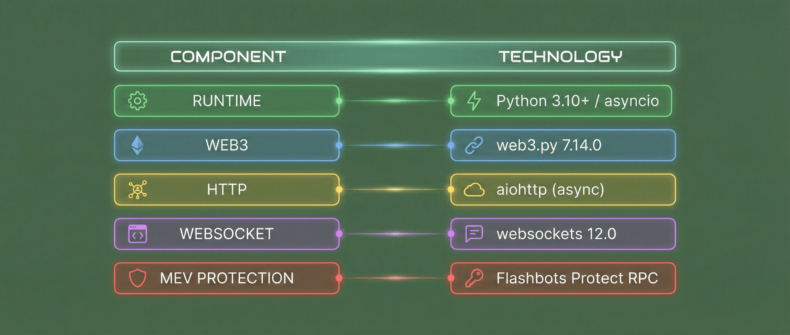
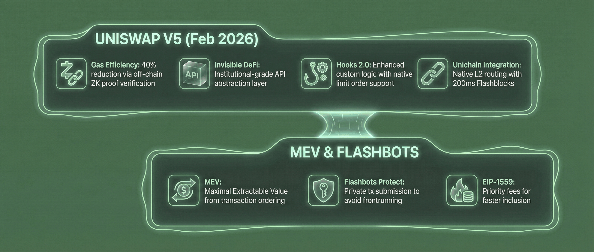
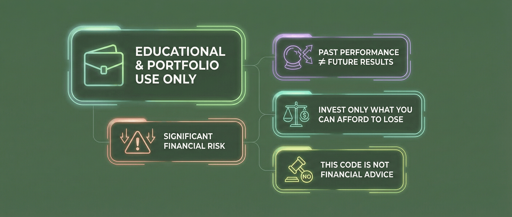

<p align="center">
  
</p>

# 🎯 EVM Mempool Sniper Bot

[](https://www.python.org/downloads/)
[](https://web3py.readthedocs.io/)
[](LICENSE)

A high-performance liquidity sniping bot for **Uniswap V5** and **Unichain L2**, featuring async mempool monitoring, Flashbots integration, and honeypot detection.


## 📸 Demo


---

## ⚡ Features


---

## 🏗️ Architecture



---

## 🚀 Quick Start

### Prerequisites

- Python 3.10+
- Alchemy or Infura WebSocket RPC
- (Optional) Flashbots reputation key

### Installation

```bash
# Clone the repository
git clone https://github.com/yourusername/evm-mempool-sniper.git
cd evm-mempool-sniper

# Create virtual environment
python -m venv .venv
.venv\Scripts\activate  # Windows
# source .venv/bin/activate  # Linux/Mac

# Install dependencies
pip install -r requirements.txt

# Configure environment
cp .env.example .env
# Edit .env with your RPC URLs and private key
```

### Run Demo

```bash
python sniper.py
```

**Expected Output:**

```
=================================================================
  UNISWAP SNIPER BOT v1.0.0
  Mempool Monitor | Flashbots Protect | Multi-Chain
=================================================================

[2024-05-22 14:30:15] INFO: Starting Ethereum mempool monitor...
[2024-05-22 14:30:17] INFO: Connected to Sepolia Testnet via Infura.
[2024-05-22 14:31:02] EVENT: PairCreated detected on Uniswap V2!
[2024-05-22 14:31:02] EVENT: PairCreated detected on Uniswap V2! Token: 0x....8f2a (TEST/ETH)
[2024-05-22 14:31:02] ACTION: Initiating buy transaction...  Gas: 150 gwei
[2024-05-22 14:31:03] SUCCESS: Buy transaction confirmed in block 5678901.
[2024-05-22 14:31:05] INFO: Calculating arbitrage opportunity...
[2024-05-22 14:31:06] ACTION: Executing sell on Sushiswap...
[2024-05-22 14:31:08] SUCCESS: Sell transaction confirmed. Simulated Profit: +0.045 ETH
[2024-05-22 14:31:10] INFO: Continuing mempool scan...
```

---

## 🔧 Configuration

Edit `.env` with your settings:

```env
# RPC Endpoints (WebSocket required)
ETH_WSS=wss://eth-mainnet.g.alchemy.com/v2/YOUR_KEY

# Wallet (use dedicated wallet!)
PRIVATE_KEY=your_private_key

# Flashbots
FLASHBOTS_RELAY=https://relay.flashbots.net
```

Trading parameters in `sniper.py`:

```python
SNIPE_AMOUNT_ETH = 0.5      # ETH per snipe
SLIPPAGE_PERCENT = 5.0      # Max slippage
PRIORITY_FEE_GWEI = 2.5     # Miner tip
MAX_BUY_TAX = 10.0          # Max acceptable tax
```

---

## 🔐 Security Features



---

## 🛠️ Technical Stack



---

## 📚 Key Concepts



---

## ⚠️ Disclaimer



---

## 📄 License

MIT License - see [LICENSE](License) for details.

<p align="center">
  Built with ❤️ for the Web3 community
</p>
